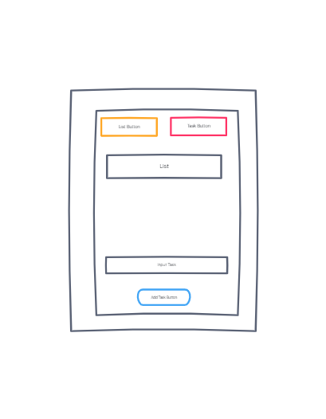
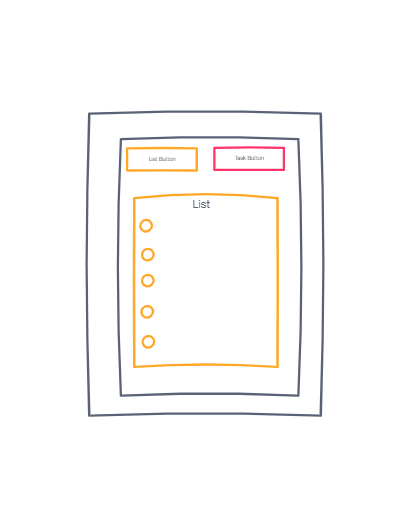
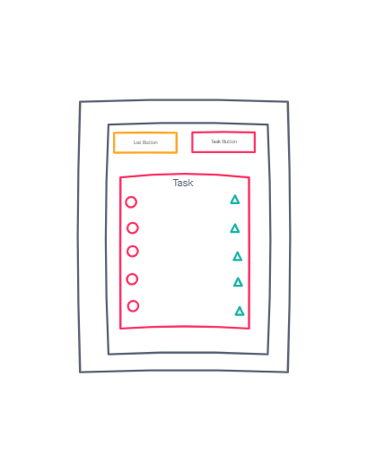

# Todo-List

Building a basic todo list using React, React Hooks, TypeScript, and Material UI

## 🚀 Getting Started

1. Fork our repo [GitHub](https://github.com/mrloulass/todo-list)
1. Clone the repo `git clone`
1. Install dependencies `npm i`
1. Start a development server `npm start`

## 📖 Table of Contents

### [Wireframe](#-Wireframe)

### [Dependencies](#-Dependencies)

### [Resources](#-Resources)

## 🛠 Wireframe

## 📦 Dependencies

- [Material UI](https://material-ui.com/)
- [React](https://reactjs.org/docs/getting-started.html)
- [React Router DOM](https://reactrouter.com/web/guides/quick-start)
- [React Hooks](https://reactjs.org/docs/hooks-intro.html)

- [TypeScript](https://www.typescriptlang.org/docs/)

## 🔍 Resources

### Using React with TypeScript

- [React Docs](https://reactjs.org/docs/static-type-checking.html#typescript)

- [TypeScript Docs](https://www.typescriptlang.org/docs/handbook/react.html)

- [YouTube Tutorial with Kevin Wade](https://www.youtube.com/watch?v=CUyl3LdBvGU)

